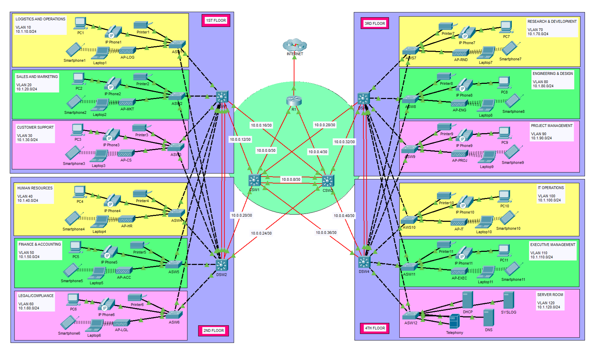

# Cisco Packet Tracer Network Project

## Project Overview

This project presents a fully functional enterprise network simulation built in Cisco Packet Tracer for a four-floor office building with 11 departments and a dedicated server room. The design follows the 3-Tier Hierarchical Network Model, organized into three layers:

1. Access Layer
2. Distribution Layer
3. Core Layer

An Edge Router connects the internal network to a simulated ISP, enabling internet access through dynamic NAT. The design emphasizes redundancy, security, and scalability, reflecting real-world enterprise network standards.

---

## Network Topology

---

## Key Features

### 1. VLANs and Trunking
- 15 VLANs configured for department segmentation, voice, management, and unused ports
- VTP configured in Server/Client mode for centralized VLAN management
- 802.1Q trunking with a dedicated native VLAN on all uplinks

### 2. EtherChannel
- Layer 2 EtherChannel between distribution switch pairs (DSW1-DSW2, DSW3-DSW4)
- Layer 3 EtherChannel between core switches (CSW1-CSW2)
- All EtherChannels use LACP for dynamic negotiation

### 3. Hot Standby Router Protocol (HSRP)
- HSRPv2 configured on all 14 VLANs across four distribution switches
- Active and standby roles are load-balanced across switch pairs per VLAN
- Ensures seamless gateway failover for all end devices

### 4. Rapid Spanning Tree Protocol (RSTP)
- Rapid PVST+ enabled on all access and distribution switches
- Root and secondary bridge roles aligned with HSRP active and standby roles
- PortFast and BPDU Guard applied on all access ports facing end devices

### 5. Dynamic Routing (OSPF)
- Single-area OSPF (Area 0) deployed across all Layer 3 devices
- Point-to-point network type configured on all routed links
- Default route redistributed from the edge router into OSPF

### 6. Dynamic Host Configuration Protocol (DHCP)
- Centralized DHCP server handles IP allocation for all 11 data VLANs
- DHCP relay agents configured on distribution switches for inter-VLAN forwarding
- Separate voice DHCP pools with TFTP Option 150 served by the telephony router

### 7. DNS, NTP, Syslog
- Internal DNS server with A and CNAME records for internal and simulated external domains
- NTP hierarchy from ISP to edge router to all downstream devices with MD5 authentication
- Centralized syslog server collects logs from all network devices

### 8. Network Address Translation (NAT)
- Dynamic PAT configured on the edge router for internet-bound traffic
- All internal subnets are translated through a single public IP interface

### 9. IP Telephony
- Cisco Unified CME configured on a dedicated telephony router
- 11 IP phones registered across all departments
- Voice VLAN segmented from data traffic with dedicated DHCP and HSRP support

### 10. Access Control Lists (ACLs)
- Server protection ACL restricts server room access to IT department and essential services only
- Voice isolation ACL confines phone traffic to the Telephony router and inter-floor communication
- Accounting restriction ACL limits the Finance department to servers and IT only
- Standard access ACL blocks all departments from infrastructure, management, and voice subnets

### 11. Layer 2 Security
- Port security with sticky MAC addresses and restrict violation on all access ports
- DHCP snooping enabled on all access switches with trusted uplinks and rate-limited access ports
- Dynamic ARP Inspection (DAI) enabled with source MAC, destination MAC, and IP validation

### 12. SSH
- SSHv2 with 4096-bit RSA keys configured on all network devices
- VTY access restricted exclusively to the IT department
- CDP disabled on all interfaces facing end devices

### 13. Wireless
- 11 autonomous access points deployed, one per department
- Per-department SSIDs with WPA2-PSK authentication
- Non-overlapping 5 GHz channels assigned to minimize interference

---

## How to use

**Open the completed simulation:**  
Download and open [`packet-tracer-file/3-tier-enterprise-network.pkt`](packet-tracer-file/3-tier-enterprise-network.pkt) in Cisco Packet Tracer.

**Recreate the project from scratch:**   
1\. Download the unconfigured topology file [here](packet-tracer-file/3-tier-enterprise-network_no-config.pkt).  
2\. Follow the step-by-step guides in [`configs/step-by-step/`](configs/step-by-step/) in numerical order, starting from `01-initial-setup.txt`.

**Reference the network design:**  
All IP addressing, VLAN tables, HSRP roles, ACL rules, and other design details are documented in [`network-documentation.md`](network-documentation.md).

---

## Author
This project was designed and implemented by ***Kirby Bryant Carel***
